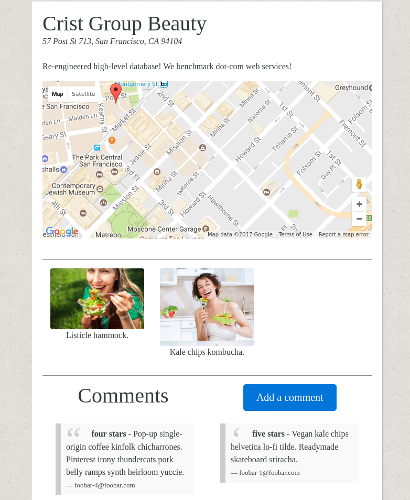

# Nomster

A Yelp clone that integrates with the Google Maps API and includes features like user comments, star ratings, image uploading, and user authentication.
Demo available [here](https://nomster-miljinx.herokuapp.com/).

### User Authentication and Permissions

[devise](https://github.com/plataformatec/devise) is used for account creation and permissions. Only logged in users are allowed to create pages for places and comment, rate, and upload images to their own or other users' places. Only the user who created a place page is allowed to edit its description or delete it all together.

### Displaying Maps

Geocoding (converting addresses to longitude and latitude) is done with the Bing Maps API and integrated into Rails with the [Geocoder](https://github.com/alexreisner/geocoder) gem. Actually displaying a map that includes a [marker](https://developers.google.com/maps/documentation/javascript/markers) is done with the Google Maps API.

### Uploading Images

[CarrierWave](https://github.com/carrierwaveuploader/carrierwave) is used to support file uploads in Rails. In development, one can save uploaded images to the machine that is running the local server. However, Heroku [will not save uploaded files on their servers](https://devcenter.heroku.com/articles/dynos#ephemeral-filesystem). Therefore, file uploads are stored with Amazon S3.

### Email Notifications

Emails are sent to users when a place page they created gets a comment. This is done with Rails' Action Mailer and ActiveRecord callbacks. SendGrid is used as the production email server because it is integrated with Heroku.

### Seeding Data

The most involving part of creating sample data for the Heroku demo is getting legitimate addresses to work with the map feature. This app uses addresses from a [government website](https://data.sfgov.org/browse) for a populous city (San Francisco). Downloaded addresses were cleaned up, simplified, and stored in a CSV file for easy access.
